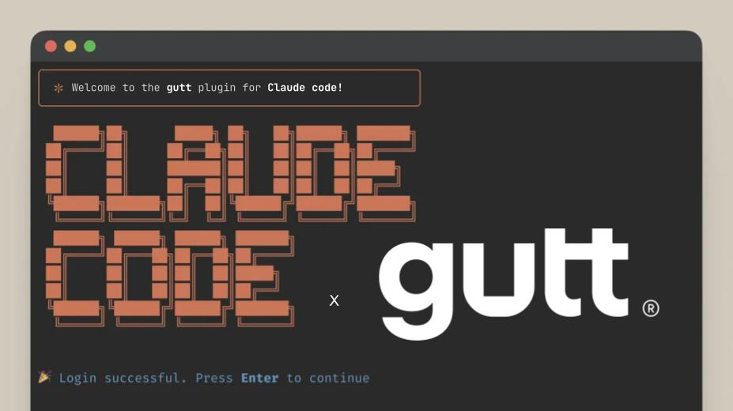
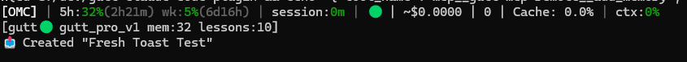

<p align="center">
  
</p>

# gutt Claude Code Plugin

Persistent organizational memory for Claude Code via [gutt](https://gutt.pro).

## What is gutt?

[gutt](https://gutt.pro) is persistent organizational memory for AI agents.

- **Decisions** — Who decided what, when, and why
- **Lessons** — What worked, what didn't, don't repeat mistakes
- **Context** — Projects, people, relationships, history

This plugin connects Claude Code to your gutt memory, automatically:

- 📥 **Retrieves** relevant context before every task
- 📤 **Captures** lessons after every task
- 🔄 **Works with OMC** — All agents get memory, automatically

[**Sign up for gutt →**](https://gutt.pro)

---

## Overview

This plugin provides a memory backbone for Claude Code, enabling:

- **Automatic memory retrieval** before every task
- **Lesson capture prompts** after significant work
- **Auto-linting** after file edits
- **Multi-hop graph exploration** for deep organizational insights

## Quick Start

### Installation

#### Via Marketplace (Recommended)

```bash
# Add the gutt marketplace
/plugin marketplace add iBrain-BVBA/gutt-claude-code-plugin

# Install the plugin
/plugin install gutt-claude-code-plugin
```

#### Manual Installation

1. Clone this repository to your Claude Code plugins directory:

   ```bash
   git clone https://github.com/iBrain-BVBA/gutt-claude-code-plugin ~/.claude-plugins/gutt-claude-code-plugin
   ```

2. Add to your Claude Code settings (`~/.claude/settings.json` or project `.claude/settings.json`):

   ```json
   {
     "plugins": {
       "gutt-claude-code-plugin": "~/.claude-plugins/gutt-claude-code-plugin"
     }
   }
   ```

3. Restart Claude Code to activate the plugin

### Setup

After installing the plugin, run the setup wizard to configure your gutt connection:

```
/gutt-claude-code-plugin:setup
```

Or use the shorter alias:

```
/gutt-claude-code-plugin:start
```

Or configure manually:

1. Copy the template:

   ```bash
   cp .mcp.json.template .mcp.json
   ```

2. Edit `.mcp.json` and replace the entire URL with your organization's MCP endpoint:

   ```json
   {
     "gutt-mcp-remote": {
       "type": "http",
       "url": "https://your-org-mcp-server.a.run.app/mcp"
     }
   }
   ```

3. Restart Claude Code to load the MCP server

## Features

### Statusline

Real-time gutt status in your Claude Code HUD:



- **Connection status** — Green circle when connected
- **Memory stats** — `mem:X` queries, `lessons:X` captured
- **Toast notifications** — Shows memory operations for 5 seconds

Enable in `config.json`:

```json
{
  "gutt": {
    "statusline": {
      "showTicker": true
    }
  }
}
```

### Hooks

| Hook                     | Event            | Purpose                                  |
| ------------------------ | ---------------- | ---------------------------------------- |
| `user-prompt-submit.cjs` | UserPromptSubmit | Reminds to search memory before tasks    |
| `stop-lessons.cjs`       | Stop             | Prompts for lesson capture after work    |
| `post-tool-lint.cjs`     | PostToolUse      | Auto-lints files after Edit/Write        |
| `pre-task-memory.cjs`    | PreToolUse       | Injects memory context before subagents  |
| `post-task-lessons.cjs`  | PostToolUse      | Captures lessons when subagents complete |
| `post-memory-ops.cjs`    | PostToolUse      | Tracks memory tool calls for statusline  |
| `statusline.cjs`         | Notification     | Renders gutt status in HUD               |

**Subagent Coverage:** The `pre-task-memory` and `post-task-lessons` hooks ensure that ALL subagents (including OMC's 32 agents) get organizational context and contribute lessons back.

### Skills

| Skill            | Command                                     | Purpose                                      |
| ---------------- | ------------------------------------------- | -------------------------------------------- |
| memory-retrieval | `/gutt-claude-code-plugin:memory-retrieval` | 3-part memory search (facts, nodes, lessons) |
| memory-capture   | `/gutt-claude-code-plugin:memory-capture`   | Structured lesson capture with 4 patterns    |

### Agents

| Agent              | Purpose                                           |
| ------------------ | ------------------------------------------------- |
| `gutt-pro-memory`  | Multi-hop graph exploration and search strategies |
| `memory-keeper`    | Autonomous lesson capture after significant work  |
| `config-discovery` | Scan repos for Claude Code config drift           |

## Usage

### Memory Retrieval

Search organizational memory before starting work:

```
/gutt-claude-code-plugin:memory-retrieval "authentication patterns"
```

Returns:

- Related facts (relationships between entities)
- Relevant nodes (Lessons, Decisions, People, WorkItems)
- Domain-specific lessons

### Memory Capture

Capture learnings using one of 4 patterns:

```
/gutt-claude-code-plugin:memory-capture "We decided to use relative paths instead of env vars for cross-platform compatibility"
```

**Patterns:**

- **Negation**: "X does NOT work because Y"
- **Replacement**: "Instead of X, use Y"
- **Decision**: "We decided X because Y"
- **Lesson**: "Learned that X when Y"

## Integration with oh-my-claudecode

This plugin works seamlessly alongside oh-my-claudecode:

1. gutt hooks fire **before** OMC hooks
2. Memory context is available when OMC orchestration starts
3. OMC sub-agents can call gutt MCP tools

## File Structure

```
gutt-claude-code-plugin/
├── .claude-plugin/
│   └── plugin.json          # Plugin manifest
├── docs/
│   └── statusline-hud.png   # HUD screenshot
├── hooks/
│   ├── user-prompt-submit.cjs  # Memory reminder
│   ├── stop-lessons.cjs        # Lesson capture prompt
│   ├── post-tool-lint.cjs      # Auto-lint
│   ├── pre-task-memory.cjs     # Subagent context injection
│   ├── post-task-lessons.cjs   # Subagent lesson capture
│   ├── post-memory-ops.cjs     # Memory tool tracking
│   └── statusline.cjs          # HUD statusline
├── skills/
│   ├── memory-retrieval/SKILL.md
│   └── memory-capture/SKILL.md
├── agents/
│   ├── gutt-pro-memory.md
│   ├── memory-keeper.md
│   └── config-discovery.md
├── commands/
│   ├── setup.md               # Setup wizard
│   └── start.md               # Alias for setup
├── .mcp.json                 # MCP server template
└── README.md
```

## Requirements

- Claude Code CLI
- Node.js 18+
- gutt MCP server access (contact your organization admin)

## Cross-Platform Support

This plugin works on:

- macOS (ARM and Intel)
- Linux (Ubuntu, etc.)
- Windows (PowerShell, Git Bash)

**Note:** Hooks use relative paths for cross-platform compatibility.

## Troubleshooting

### Hook not firing

1. Check `.claude/settings.json` includes the hooks
2. Verify Node.js is in PATH
3. Check hook file permissions

### MCP connection failed

1. Verify API key with your organization admin
2. Check network connectivity to your organization's MCP endpoint
3. Try: `npx -y @gutt/mcp-remote --version`

### Memory search returns no results

1. Ensure you're using the correct group_id
2. Try broader search terms
3. Check if memory has been populated

## Contributing

1. Fork the repository
2. Create a feature branch
3. Follow conventional commits
4. Submit a pull request

## License

MIT License - see [LICENSE](LICENSE)

## Links

- [gutt Website](https://gutt.pro)
- [Report Issues](https://github.com/iBrain-BVBA/gutt-claude-code-plugin/issues)
