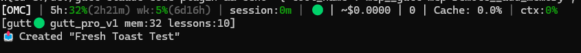

<p align="center">
  
</p>

# gutt Plugin for Claude Code & Cursor

Persistent organizational memory for [Claude Code](https://claude.ai/claude-code) and [Cursor](https://cursor.com) via [gutt](https://gutt.pro).

## What is gutt?

[gutt](https://gutt.pro) is persistent organizational memory for AI agents.

- **Decisions** — Who decided what, when, and why
- **Lessons** — What worked, what didn't, don't repeat mistakes
- **Context** — Projects, people, relationships, history

This plugin connects Claude Code to your gutt memory, automatically:

- 📥 **Retrieves** relevant context before every task
- 📤 **Captures** lessons after every task
- 🔄 **Works with subagents** — All agents get memory, automatically

[**Sign up for gutt →**](https://gutt.pro)

---

## Overview

This plugin provides a memory backbone for Claude Code, enabling:

- **Automatic memory retrieval** before every task
- **Lesson capture prompts** after significant work
- **Auto-linting** after file edits
- **Multi-hop graph exploration** for deep organizational insights

## Quick Start

### Via Marketplace (Recommended)

1. **Install:** `claude plugin add gutt-claude-code-plugin@gutt-plugins`
2. **Setup:** Run `/gutt-claude-code-plugin:onboard`
3. **Done** — memory integration is active

### Manual Install (Developers)

1. **Clone:** `git clone https://github.com/iBrain-BVBA/gutt-claude-code-plugin ~/.claude-plugins/gutt-claude-code-plugin`
2. **Enable:** Add to `.claude/settings.json` under `"plugins"`
3. **Setup:** Run `/gutt-claude-code-plugin:onboard`

> **Shared hook libs:** Hook libraries have a single source in `shared/`; each plugin's `hooks/lib/*` symlinks into it. Running from a cloned repo resolves those symlinks in place. Note that `--plugin-dir` / local-path installs do **not** dereference cross-plugin symlinks — to test a real install, use the git marketplace source. Marketplace installs dereference them automatically into real files.

### Cursor

#### Installation

1. In Cursor, run `/add-plugin` and enter the repo URL: `https://github.com/iBrain-BVBA/gutt-claude-code-plugin`
2. Run the setup command to configure the MCP connection
3. Enter your organization's gutt MCP endpoint URL when prompted
4. Restart Cursor → **Settings → Tools & MCP Servers** → Connect `gutt-mcp-remote`
5. Complete OAuth login

Cursor doesn't support all Claude Code hooks. 4 of 11 hooks are portable (prompt submit, file edit lint, pre-task memory, stop lessons). Missing automation is compensated by Cursor rules (`.mdc`) that guide memory-first workflows.

See [docs/team-onboarding.md](docs/team-onboarding.md) for detailed installation instructions for both IDEs.

## Features

### Statusline

Real-time gutt status in your Claude Code HUD:



- **Connection status** — Green circle when connected
- **Memory stats** — `mem:X` queries, `lessons:X` captured
- **Toast notifications** — Shows memory operations for 5 seconds

The statusline is auto-enabled on first session. Optional settings in `~/.claude/settings.json`:

```json
{
  "gutt": {
    "statusline": {
      "showTicker": true,
      "multiLine": true
    }
  }
}
```

### Hooks

> **Note:** Hooks can be registered in either `hooks/hooks.json` (plugin-level) or `.claude/settings.json` (project-level). The table below shows all available hooks.

| Hook                        | Event            | Purpose                                      |
| --------------------------- | ---------------- | -------------------------------------------- |
| `session-start.cjs`         | SessionStart     | Shows setup reminder if not configured       |
| `sessionstart-setup.cjs`    | SessionStart     | Auto-enables HUD statusline on first run     |
| `user-prompt-submit.cjs`    | UserPromptSubmit | Reminds to search memory before tasks        |
| `stop-lessons.cjs`          | Stop             | Prompts for lesson capture after work        |
| `post-tool-lint.cjs`        | PostToolUse      | Auto-lints files after Edit/Write            |
| `pre-task-memory.cjs`       | PreToolUse       | Injects memory context before subagents      |
| `post-task-lessons.cjs`     | PostToolUse      | Captures lessons when subagents complete     |
| `post-memory-ops.cjs`       | PostToolUse      | Tracks memory tool calls for statusline      |
| `subagent-start-memory.cjs` | SubagentStart    | Injects cached memory context into subagents |
| `subagent-plan-review.cjs`  | SubagentStop     | Suggests GUTT memory search after plans      |

**Subagent Coverage:** The `pre-task-memory` and `post-task-lessons` hooks ensure that ALL subagents get organizational context and contribute lessons back.

### Skills

| Skill            | Command                                     | Purpose                                    |
| ---------------- | ------------------------------------------- | ------------------------------------------ |
| memory-search    | `/gutt-claude-code-plugin:memory-search`    | Shallow-first, summary-first memory search |
| memory-capture   | `/gutt-claude-code-plugin:memory-capture`   | Structured lesson capture with 4 patterns  |
| memory-retrieval | `/gutt-claude-code-plugin:memory-retrieval` | Deprecated alias → use memory-search       |

### Agents

| Agent              | Purpose                                           |
| ------------------ | ------------------------------------------------- |
| `gutt-pro-memory`  | Multi-hop graph exploration and search strategies |
| `memory-keeper`    | Autonomous lesson capture after significant work  |
| `config-discovery` | Scan repos for Claude Code config drift           |

## Usage

### Memory Search

Search organizational memory before starting work:

```
/gutt-claude-code-plugin:memory-search "authentication patterns"
```

Returns:

- Related facts (relationships between entities)
- Relevant nodes (Lessons, Decisions, People, WorkItems)
- Domain-specific lessons

### Memory Capture

Capture learnings using one of 4 patterns:

```
/gutt-claude-code-plugin:memory-capture "We decided to use relative paths instead of env vars for cross-platform compatibility"
```

**Patterns:**

- **Negation**: "X does NOT work because Y"
- **Replacement**: "Instead of X, use Y"
- **Decision**: "We decided X because Y"
- **Lesson**: "Learned that X when Y"

## File Structure

```
gutt-plugins/                       # marketplace repo (name: gutt-plugins)
├── .claude-plugin/
│   └── marketplace.json           # lists gutt-core + auto-lint-plugin
├── shared/                         # single source for hook libs; plugins symlink these
├── gutt-core/                      # core plugin — name: gutt-claude-code-plugin, displayName: gutt-core
│   ├── .claude-plugin/plugin.json
│   ├── hooks/                      # Claude Code hooks (.cjs); hooks/lib/* symlink → shared/
│   ├── skills/                     # memory-search, memory-capture, onboard, skills-discovery
│   ├── agents/                     # gutt-pro-memory, memory-keeper, and other memory agents
│   ├── commands/                   # setup, start, health, reset-counters
│   ├── rules/gutt-memory.mdc       # Cursor rule for memory-first workflow
│   ├── mcp.json                    # MCP config template
│   └── config.json.example
├── auto-lint-plugin/               # standalone lint-on-edit plugin (no gutt dependency)
├── plugins/
│   └── gutt-subagent-hooks-plugin/ # legacy subagent hooks (retired in a later 3.0 story)
├── docs/                           # banner, HUD screenshot, team-onboarding guide
├── tests/
├── package.json
└── README.md
```

## Requirements

- Claude Code CLI ≥ 2.1.143 (multi-plugin marketplace with `displayName`) or Cursor 2.5+
- Node.js 18+
- gutt MCP server access (contact your organization admin)

## Cross-Platform Support

This plugin works on:

- macOS (ARM and Intel)
- Linux (Ubuntu, etc.)
- Windows (PowerShell, Git Bash)

**Note:** Hooks use relative paths for cross-platform compatibility.

**Windows contributors:** The shared hook libs use git symlinks. Enable them with `git config core.symlinks true` (or turn on Developer Mode) before cloning, or the links check out as plain text files. End users installing from the marketplace are unaffected — Claude Code copies real files into its cache.

## Troubleshooting

### Hook not firing

1. Verify plugin is installed: run `/plugins` to check gutt-claude-code-plugin is listed
2. Verify Node.js is in PATH
3. Restart Claude Code to reload hooks

### MCP connection failed

1. Verify OAuth completed: run `/mcp`, select `gutt-mcp-remote`, choose "Authenticate"
2. Check network connectivity to your organization's MCP endpoint
3. Contact your organization admin if authentication fails

### Memory search returns no results

1. Verify OAuth authentication completed successfully
2. Try broader search terms
3. Check if memory has been populated for your organization

## Contributing

1. Fork the repository
2. Create a feature branch
3. Follow conventional commits
4. Submit a pull request

## License

MIT License - see [LICENSE](LICENSE)

## Links

- [gutt Website](https://gutt.pro)
- [Report Issues](https://github.com/iBrain-BVBA/gutt-claude-code-plugin/issues)
