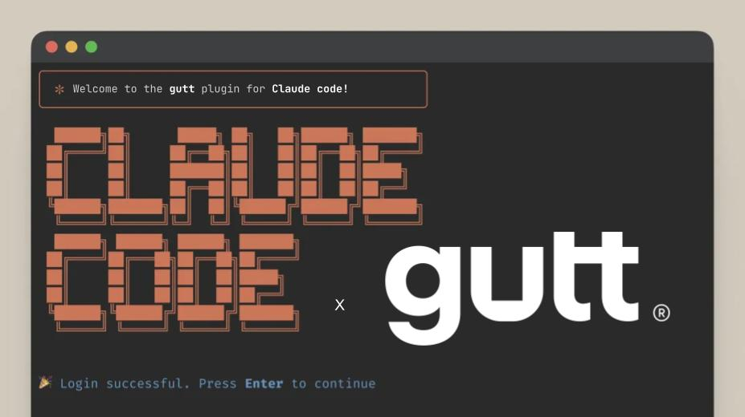

<p align="center">
  
</p>

# gutt Plugin for Claude Code & Cursor

Persistent organizational memory for [Claude Code](https://claude.ai/claude-code) and [Cursor](https://cursor.com) via [gutt](https://gutt.pro).

## What is gutt?

[gutt](https://gutt.pro) is persistent organizational memory for AI agents.

- **Decisions** — Who decided what, when, and why
- **Lessons** — What worked, what didn't, don't repeat mistakes
- **Context** — Projects, people, relationships, history

This plugin connects Claude Code to your gutt memory, automatically:

- 📥 **Retrieves** relevant context before every task
- 📤 **Captures** lessons after every task
- 🔄 **Session-aware** — Memory context follows the session lifecycle

[**Sign up for gutt →**](https://gutt.pro)

---

## Overview

This plugin provides a memory backbone for Claude Code, enabling:

- **Automatic memory retrieval** before every task
- **Lesson capture prompts** after significant work
- **Auto-linting** after file edits
- **Multi-hop graph exploration** for deep organizational insights

## Quick Start

### Via Marketplace (Recommended)

1. **Install:** `claude plugin add gutt-pro@gutt-plugins`
2. **Setup:** Run `/gutt-pro:onboard`
3. **Done** — memory integration is active

### Manual Install (Developers)

1. **Clone:** `git clone https://github.com/iBrain-BVBA/gutt-claude-code-plugin ~/.claude-plugins/gutt-claude-code-plugin`
2. **Enable:** Add to `.claude/settings.json` under `"plugins"`
3. **Setup:** Run `/gutt-pro:onboard`

> **Hook libs:** each plugin owns its `hooks/lib/*` outright, as real files — no symlinks and no code shared between plugins, so a clone runs the same way an install does. A `"source": "directory"` marketplace entry loads in place with no copy step, which means the working tree is what executes and an uncommitted edit takes effect on the next session.

### Cursor

#### Installation

1. In Cursor, run `/add-plugin` and enter the repo URL: `https://github.com/iBrain-BVBA/gutt-claude-code-plugin`
2. Run the setup command to configure the MCP connection
3. Enter your organization's gutt MCP endpoint URL when prompted
4. Restart Cursor → **Settings → Tools & MCP Servers** → Connect `gutt-mcp-remote`
5. Complete OAuth login

Cursor doesn't support all Claude Code hooks. The portable ones are prompt submit and file edit lint. Missing automation is compensated by Cursor rules (`.mdc`) that guide memory-first workflows.

See [docs/team-onboarding.md](docs/team-onboarding.md) for detailed installation instructions for both IDEs.

## Features

### Statusline

gutt's state, live in your Claude Code status bar. **Opt in with one command:**

```
/gutt-pro:statusline
```

That is the only way it appears — Claude Code accepts a status line only from your
own `~/.claude/settings.json`, and nothing here writes that file unless you ask.
`/gutt-pro:statusline off` removes it again; `/gutt-pro:statusline status` reports
where things stand. Your existing settings are backed up before either change, and a
status line you wrote yourself is never touched or overwritten.

```
[gutt 🟢 on acme-eng] | [Opus 5] ctx 38%
```

| Segment     | Means                                                                |
| ----------- | -------------------------------------------------------------------- |
| 🟢          | a gutt call came back — the server is reachable and authenticated    |
| 🟡 `auth`   | the connection needs re-authenticating                               |
| 🔴          | a call failed, or the server's tools have gone from the tool list    |
| ⚪          | nothing observed yet, or nothing for a while                         |
| `on`        | recall is live                                                       |
| `off`       | durably disabled — `/gutt-pro:on` brings it back                     |
| `zzz→14:30` | snoozed until then; `zzz` alone means for the rest of this session   |
| `hitl`      | capture mode is human-in-the-loop (shown only when it is not `auto`) |
| `!`         | no gutt MCP server is configured — run `/gutt-pro:setup`             |
| `acme-eng`  | the group this session writes to                                     |
| `ctx 38%`   | how much of the context window is spent                              |

**Green is earned, not assumed.** It means a real call to the server came back, so
it reports reachability and authentication together. Three signals feed it, and
they cover each other's blind spots: responses to gutt tool calls say whether the
server is answering and whether it accepted your credentials; the session
transcript says whether its tools are still in the tool list, which is the only way
to notice a server nobody is calling; and an observation nobody has refreshed in
ten minutes lapses back to ⚪ rather than going stale green.

A configuration check at session start cannot do this — a hook has no way to open a
socket, so it can only ever establish that a server is _named in a settings file_.
That is reported separately, as `!`.

Context window usage is deliberately absent — Claude Code already displays it, and
this bar is for gutt state.

Segments drop from the right as the terminal narrows; the state segment always stays.

> **Upgrading from 2.x?** Your old HUD stops working — it pointed into a 2.x path
> that no longer exists, and the plugin removes the dead entry for you. Run
> `/gutt-pro:statusline` once to get the new one, which survives future upgrades.
>
> **HUD disappeared on its own?** Claude Code sometimes drops `statusLine` while
> rewriting `settings.json`
> ([#62486](https://github.com/anthropics/claude-code/issues/62486), closed as not
> planned). The next session restores it automatically, or run
> `/gutt-pro:statusline` again.

### Hooks

> **Note:** Hooks can be registered in either `hooks/hooks.json` (plugin-level) or `.claude/settings.json` (project-level). The table below shows all available hooks.

| Hook                       | Event            | Purpose                                                                                                                                                            |
| -------------------------- | ---------------- | ------------------------------------------------------------------------------------------------------------------------------------------------------------------ |
| `session-start.cjs`        | SessionStart     | Opens the session record, runs the state TTL sweep                                                                                                                 |
| `session-connectivity.cjs` | SessionStart     | Async MCP connectivity probe for the HUD; keeps the statusline entry point current                                                                                 |
| `session-end.cjs`          | SessionEnd       | Finalizes the session record, clears session snooze                                                                                                                |
| `user-prompt-submit.cjs`   | UserPromptSubmit | Applies `/gutt-pro:*` config commands; points at `memory-search` on a new session or after a compaction; refreshes whether gutt's tools are still in the tool list |
| `stop-capture.cjs`         | Stop             | Shells out to `claude -p` to judge the turn; honours an off/disable and `mode`, defers while background agents run                                                 |
| `post-memory-search.cjs`   | PostToolUse      | Matched at the gutt MCP server; resets the recall-recency counter after a search, and records what the call proved about the connection                            |

`statusline.cjs` is not in this table because it is not a hook. Claude Code runs it
as a status line, from your own settings — see [Statusline](#statusline).

### Settings — the `/gutt-pro:` commands

Type these at any time; the change is applied by the UserPromptSubmit hook before the
model reads anything, and written to `${CLAUDE_PLUGIN_DATA}/config.json`.

| Command                     | Effect                                                                                     |
| --------------------------- | ------------------------------------------------------------------------------------------ |
| `/gutt-pro:config`          | Show the stored settings and the state they add up to                                      |
| `/gutt-pro:off`             | Turn recall off for the rest of this session — it comes back on its own                    |
| `/gutt-pro:off session`     | The explicit spelling of the same thing                                                    |
| `/gutt-pro:off 30`          | Turn recall off for 30 minutes (1–10080), then it resumes on its own                       |
| `/gutt-pro:disable`         | Turn recall off until `/gutt-pro:on` — survives restarts                                   |
| `/gutt-pro:on`              | Clear an off, a snooze, and a disable                                                      |
| `/gutt-pro:mode auto\|hitl` | Set the capture mode: `auto` writes a capture directly, `hitl` confirms each subject first |
| `/gutt-pro:statusline`      | Install the HUD in your `~/.claude/settings.json` (`off` removes it, `status` reports it)  |

**`off` is temporary and `disable` is durable.** The cheap, reversible action gets the
short word; turning recall off for good has to be typed on purpose. If you used the 3.0
`/gutt off` for a durable off, `/gutt-pro:disable` is what you now want — see
[docs/migration-3.0.md](docs/migration-3.0.md).

The 3.0 spellings `/gutt …`, `/gutt:<sub>` and `/gutt-claude-code-plugin:gutt <sub>` no
longer do anything at all. They are ordinary prompt text now, not aliases — a hard cut,
because `off` reversed meaning in the same release and an alias would have quietly done
something other than what you typed.

Bare `/off`, `/on`, `/disable` and `/mode` also reach the plugin, and it says so in its
reply when they do. Bare `/config` does not — Claude Code's own `/config` takes it first,
so `/gutt-pro:config` is the only spelling that works for that one.

The HUD shows ` off` or ` zzz` in the gutt segment while recall is suppressed, since a
durable off is otherwise invisible.

Two things worth knowing. An out-of-range minute count is **rejected, not clamped** —
`/gutt-pro:off 300000` changes nothing rather than silencing recall for seven months. And
off or snooze silences **both** halves: no recall pointer is injected, and the end-of-turn
capture judge is not run at all (no subprocess is spawned). Capture mode is the other
axis — it governs only how a capture is confirmed once the judge has fired.

The judge also **defers while background agents are still working**. A turn that ends with
subagents in flight is not finished, so judging it would score a partial summary; the Stop
that runs once the last agent drains judges the whole thing instead. Background shell
commands and MCP monitors do not defer it — they cannot add a finding, and some run for the
whole session.

### Skills

| Skill            | Command                      | Purpose                                    |
| ---------------- | ---------------------------- | ------------------------------------------ |
| memory-search    | `/gutt-pro:memory-search`    | Shallow-first, summary-first memory search |
| memory-capture   | `/gutt-pro:memory-capture`   | Structured lesson capture with 4 patterns  |
| memory-retrieval | `/gutt-pro:memory-retrieval` | Deprecated alias → use memory-search       |

### Agents

Two, deliberately. An agent earns its place here only when the **separate context
window** is the point; anything that is a procedure the main agent should follow is a
skill instead.

| Agent             | Purpose                                                                                                                                |
| ----------------- | -------------------------------------------------------------------------------------------------------------------------------------- |
| `gutt-pro-memory` | Multi-hop graph exploration — traverses in its own context and returns a short cited answer, so it doesn't consume the caller's window |
| `agent-creator`   | Scaffolds agent and skill definitions with correct frontmatter, a registered memory identity, and the grounding/learning protocol      |

Autonomous end-of-turn capture is **not** an agent: the Stop hook judges the turn and
the `memory-capture` skill does the write, with the trust-tier gate applied. Twelve
further agents shipped up to 3.0 and were retired in GP-929 — they duplicated skills,
predated the memory curriculum, or belong to a role plugin (E6). `git log` has them.

### Mentoring (gutt-mentor plugin)

Individual development programs in the **personal** memory scope, shipped as a
separate plugin that depends on gutt-core: `individual-program-design` writes the
program (goals, milestones, check-in cadence) as one self-contained episode, and
`progress-tracking` reads it back, reports status from the record alone, and
chains the next check-in — so a fresh session picks up where the person stands
without re-explaining.

The `onboarding-guide` agent joins the two halves for a new joiner: it reads the
org graph for team, architecture, decisions, lessons and experts, then turns that
grounding into their own plan. **The plan goes to both scopes — personal, where it
is tracked, and (with their confirmation) org, where the next person joining that
role can learn from it. Their progress, blockers and open questions stay personal.**
Self-service: personal scope follows the authenticated login, so the joiner runs it
themselves. No hooks.

The `mentor` agent covers growth after the ramp — a goal-shaped ask ("get better
at code reviews", "grow toward tech lead") rather than new territory to map. It
elicits the goal, grounds it in whatever the org graph has recorded about it
(expectations, working agreements, lessons, people to learn from), assembles a
materials list, and turns it into a program tracked the same way. **Everything it
writes is personal — the program never goes to the org graph**, so it registers
no agent identity and tags nothing. Where the graph is thin it says so plainly
and gives general best practice, labeled as general.

## Usage

### Memory Search

Search organizational memory before starting work:

```
/gutt-pro:memory-search "authentication patterns"
```

Returns:

- Related facts (relationships between entities)
- Relevant nodes (Lessons, Decisions, People, WorkItems)
- Domain-specific lessons

### Memory Capture

Capture learnings using one of 4 patterns:

```
/gutt-pro:memory-capture "We decided to use relative paths instead of env vars for cross-platform compatibility"
```

**Patterns:**

- **Negation**: "X does NOT work because Y"
- **Replacement**: "Instead of X, use Y"
- **Decision**: "We decided X because Y"
- **Lesson**: "Learned that X when Y"

## File Structure

```
gutt-plugins/                       # marketplace repo (name: gutt-plugins)
├── .claude-plugin/
│   └── marketplace.json           # lists gutt-core + gutt-mentor
├── gutt-core/                      # core plugin — name/displayName: gutt-pro (dir keeps its name)
│   ├── .claude-plugin/plugin.json
│   ├── hooks/                      # Claude Code hooks (.cjs); hooks/lib/* are real files, owned here
│   ├── skills/                     # memory-search, memory-capture, onboard, skills-discovery
│   ├── agents/                     # gutt-pro-memory, agent-creator
│   ├── commands/                   # setup, start, health
│   ├── rules/gutt-memory.mdc       # Cursor rule for memory-first workflow
│   ├── mcp.json                    # MCP config template
│   └── config.json.example
├── gutt-mentor/                    # mentor plugin — onboarding + mentor agents, personal-scope program design/tracking (no hooks)
│   ├── agents/                     # onboarding-guide, mentor
│   └── skills/                     # individual-program-design, progress-tracking
├── docs/                           # banner, HUD screenshot, team-onboarding guide
├── tests/
├── package.json
└── README.md
```

## Requirements

- Claude Code CLI ≥ 2.1.143 (multi-plugin marketplace with `displayName`) or Cursor 2.5+
- Node.js 18+
- gutt MCP server access (contact your organization admin)

## Cross-Platform Support

This plugin works on:

- macOS (ARM and Intel)
- Linux (Ubuntu, etc.)
- Windows (PowerShell, Git Bash)

**Note:** Hooks use relative paths for cross-platform compatibility.

**Windows:** nothing extra to configure. This repository contains no symlinks and CI keeps it that way (`npm run check:no-symlinks`). Hook libraries used to be symlinks into a repo-root `shared/` directory, which broke every hook on Windows — git there defaults to `core.symlinks=false` and writes the link target path as the file's contents, so `require()` got a path string instead of JavaScript. That affected marketplace installs too, not just contributors.

## Troubleshooting

### Hook not firing

1. Verify plugin is installed: run `/plugins` to check gutt-pro is listed
2. Verify Node.js is in PATH
3. Restart Claude Code to reload hooks

### MCP connection failed

1. Verify OAuth completed: run `/mcp`, select `gutt-mcp-remote`, choose "Authenticate"
2. Check network connectivity to your organization's MCP endpoint
3. Contact your organization admin if authentication fails

### Memory search returns no results

1. Verify OAuth authentication completed successfully
2. Try broader search terms
3. Check if memory has been populated for your organization

## Contributing

1. Fork the repository
2. Create a feature branch
3. Follow conventional commits
4. Submit a pull request

## License

MIT License - see [LICENSE](LICENSE)

## Links

- [gutt Website](https://gutt.pro)
- [Report Issues](https://github.com/iBrain-BVBA/gutt-claude-code-plugin/issues)
